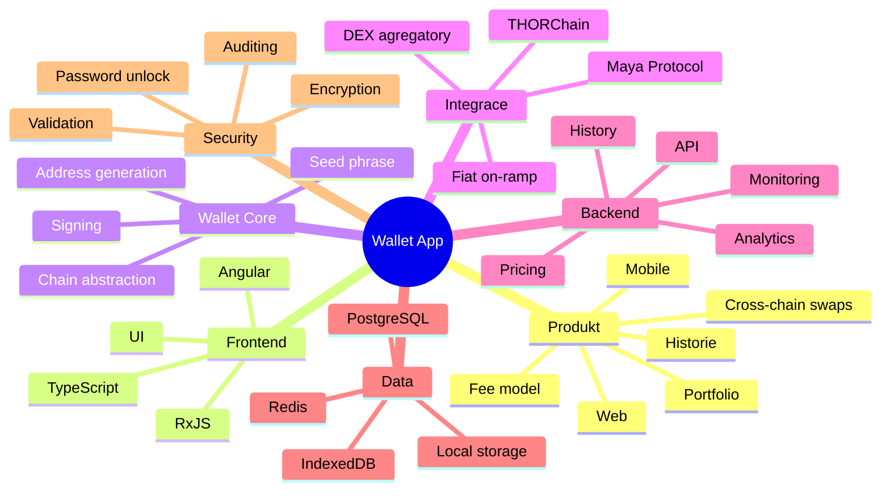

# Wallet Mind Map

## Cíl produktu
- Non-custodial wallet
- Web jako první verze
- Později mobile app
- Cross-chain swapy
- Integrace:
  - THORChain
  - Maya Protocol
  - další DEX / agregátory

## Hlavní části systému

### 1. Frontend
- Angular
- TypeScript
- RxJS
- UI knihovna:
  - Angular Material
  - nebo Tailwind + vlastní komponenty

### 2. Wallet Core
- seed phrase
- generování adres
- derivace účtů
- signing transakcí
- práce s více chainy
- oddělená abstrakce nad chainy

### 3. Blockchain integrace
- EVM chains
- Bitcoin-like chains
- THORChain
- Maya Protocol
- quote
- swap
- fee tracking
- historie transakcí

### 4. Backend
- API pro frontend
- price service
- portfolio cache
- transakční historie
- analytics
- monitoring

### 5. Uložení dat
- web:
  - localStorage jen na neškodná data
  - IndexedDB pro větší data
- citlivá data:
  - šifrovaný wallet blob
- backend:
  - PostgreSQL
  - Redis

### 6. Bezpečnost
- heslo pro odemčení wallet
- šifrování lokálně
- nikdy neukládat private key jako plain text
- audit knihoven
- validace adres
- ochrana proti phishingu

### 7. Monetizace
- affiliate fee
- swap fee
- premium funkce
- white-label řešení do budoucna

---

## Mermaid diagram

